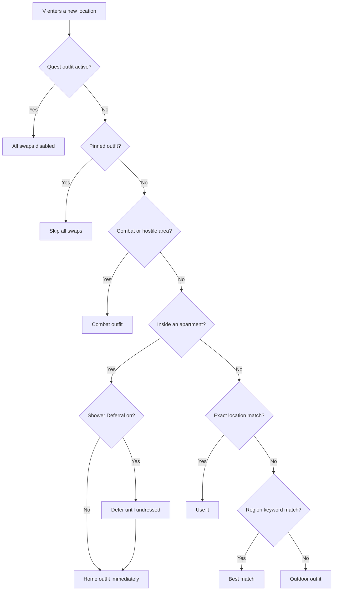

# Priority System

When V moves to a new location or enters a new context, Dynamic Wardrobe picks the best outfit using a strict order. Higher priority always wins.

## Quest Outfits

When the game forces V into a quest outfit (e.g. the diving suit), Dynamic Wardrobe steps back completely — no swaps of any kind until the quest outfit is removed.

## Pinned Outfits

A `!`-prefixed outfit blocks everything — no location, region, combat, or danger zone swaps. Only scenes that naturally change V's appearance (home entry, shower) can override it, and doing so consumes the pin. Ripper outfits temporarily override the pin but restore it when the session ends. See [Pinned Outfits](pinned.md) for details.

## Home, Nude & Ripper

These activate based on game context, regardless of location. Home and nude consume the pin; ripper temporarily overrides it but restores the pinned outfit afterward.

| Context | When It's Active |
|---------|--------------------|
| **home** | V is inside a supported apartment |
| **nude** | The game undresses V (shower, romance scenes) |
| **ripper** | V is sitting in a ripperdoc chair |

## Combat & Danger Zones

When V enters combat or a hostile area, combat outfits take priority over all location matching. Combat outfits can be location-aware too — see [Combat & Danger Zones](combat.md) for details.

## Location Matching

When none of the above contexts apply, the mod picks an outfit based on where V is:

1. **Exact location** — an outfit named after a specific location wins (e.g. `afterlife`)
2. **Region keywords** — broad area matches like `corpo`, `street`, `wild`, `club`
3. **`outdoor`** — the fallback when nothing else matches

For details on how matching, separators, and keyword stacking work, see [Priority Details](priority-advanced.md).

Visual Summary

*Ripper outfits are temporary scene overrides — the previous outfit is restored when the scene ends, including pinned outfits.*

